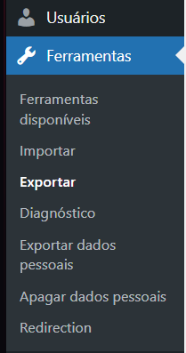
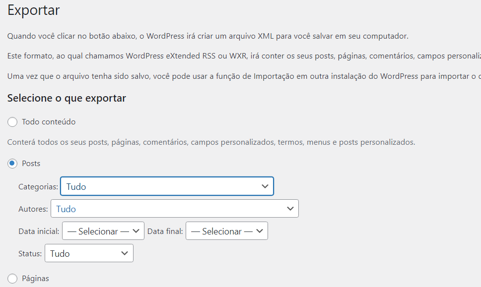

# 📝 WP Migrations


Um pacote para migrar postagens do **WordPress** para **Laravel** de maneira simples e eficiente.


## Instalação

```bash
composer require combizera/wordpress-to-laravel-migrator
```

### Informações Importantes

- O pacote não faz a migração de imagens, apenas postagens (por enquanto).
- O pacote não faz a migração de páginas, apenas postagens (por enquanto).

### Itens Necesários

Para que o pacote funcione corretamente, alguns itens são necessários:

- [ ] Ter uma `Model` para as Postagens, que necessariamente deve ter o nome de `Post`;
- [ ] A `Model` deve ter os campos `title`, `slug`, `content`, `category_id`, `created_at` e `updated_at`;
- [ ] Ter um arquivo `.xml` com as postagens do WordPress.
- [ ] Não esquecer de deixar os campos que serão preenchidos como `fillable` na `Model`.

## Utilização
```php
php artisan wp:migrate storage/migration.xml
```
##  Como Exportar os Arquivos do WordPress para XML
### Passo 1: Exportar os Arquivos do WordPress para XML

Acessar o Painel Administrativo do WordPress
Faça login no painel de administração (wp-admin) do seu site WordPress.

### Passo 2: Navegar até a Ferramenta de Exportação
No menu lateral, clique em **"Ferramentas"** e depois em **"Exportar"**.



### Passo 3: Selecionar o Tipo de Conteúdo a Exportar
Na tela de exportação, escolha **"Posts"** como o conteúdo a ser exportado.


### Passo 4: Iniciar o Download do Arquivo XML
Role a página até encontrar o botão **"Download do arquivo de exportação"**. Clique no botão para iniciar o download do arquivo XML contendo suas postagens.

Com todos os itens necessários, basta rodar o comando abaixo:
